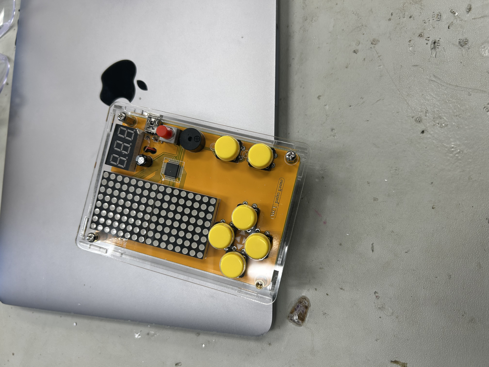

# Ball Tracking Robot
The ball-tracking robot uses a camera and computer vision to detect and follow a colored ball in real time. It processes video frames using software like OpenCV to identify the ball’s position and sends signals to the motors to move the robot toward it. This allows the robot to follow the ball smoothly as it moves around.


| **Engineer** | **School** | **Area of Interest** | **Grade** |
|:--:|:--:|:--:|:--:|
| Aidan D | Homestead High School | Electrical Engineering | Incoming Sophmore


  
# Third Milestone


# Second Milestone

## Summary 

My second milestone began with testing and validating the functionality of the motors connected to my Raspberry Pi. I wired each motor to the motor driver board and used basic GPIO control in Python to ensure that each motor could spin forward, backward, or stop as needed. This step was crucial to make sure the robot's movement would be reliable when it came time to combine the motion with visual detection. I wrote a simple Python program that let me control the motors using keyboard inputs such as w, a, s, and d to move the robot forward, left, backward, and right. This gave me a hands on way to test how each motor responded to the GPIO signals.

Next, I worked on setting up a live video stream using the Raspberry Pi Camera Module v3 and the picamera2 library. I configured the camera with a 640x480 resolution for efficient frame processing and used OpenCV (cv2) to display the video feed in real time. This live stream not only confirmed that the camera was functioning properly, but it also became the foundation for the robot's vision system.

After the camera and motor systems were tested, I moved on to the most challenging and exciting part: coding the ball tracking logic. I began by writing a function to process each video frame and detect a red colored object (the ball) in the frame. Using OpenCV, I converted each frame from BGR to HSV color space, which is more effective for color based segmentation. I defined two HSV ranges to capture the full red spectrum, accounting for the way red wraps around in HSV values. I created a binary mask to highlight red pixels and applied erosion and dilation to remove noise and small artifacts.

Once I had a clean mask, I used contour detection to locate red objects. The largest contour was assumed to be the ball. I used cv2.minEnclosingCircle() and cv2.moments() to find the center and size of the ball. If the radius of the detected circle was large enough (indicating that it wasn’t just noise), I drew a circle and label around the detected ball on the video frame.

  
## Challenges 

For my second milestone, I focused on testing and setting up the core hardware components of my Raspberry Pi robot. I began by wiring and programming the motors using GPIO pins and Python. I wrote a control script that let me move the robot in all directions using keyboard inputs, which helped confirm that the motors and H-bridge motor driver were working. A big part of this step was getting the wiring right—connecting the GPIO pins, H-bridge power, and ground lines on the breadboard. At one point, I accidentally connected my battery pack directly to the Pi’s 5V pin instead of the correct power rail, which caused the Raspberry Pi to fry and had to be replaced. I also had to troubleshoot reversed motor directions, which I fixed by swapping motor wires and adjusting the GPIO signals to control motor speed properly.

Setting up the camera came with its own set of issues. Although the hardware was connected correctly, my Raspberry Pi wasn’t recognizing the camera at first. I found out that my SD card had permission errors that were preventing it from accessing certain system files needed to detect the camera. After trying several fixes, I ended up reflashing the SD card with a fresh Raspberry Pi OS image. That solved the issue, and I was then able to use the Picamera2 library with OpenCV to create a live video stream from the camera module. I configured the camera to output at a 640x480 resolution for smoother real-time processing.

The biggest challenge in the ball tracking part was getting the mask to reliably detect the red ball. At first, the mask would pick up a lot of background noise or completely miss the ball, especially under certain lighting conditions. I adjusted the HSV color range several times and added erosion and dilation to clean up the mask. I also noticed that the ball detection would sometimes lag or miss frames, so I optimized the frame size and processing steps to make it faster. Once the ball was reliably detected, I used its x-coordinate to drive the motors, making the robot follow it depending on whether it appeared on the left, center, or right of the frame. Overall, this milestone involved solving real world hardware and software problems to build a working robot that sees and moves on its own.

## Next Steps 

For my next steps, I plan to combine the motor control, camera, and ultrasonic (SR04) sensors into a single, fully integrated system. Right now, the robot can follow the ball using the camera, but I want to add obstacle detection using the SR04 sensors so it can avoid crashing into walls or objects while tracking. This means I’ll need to write code that allows the Raspberry Pi to read distance data from the sensors in real time and make smart decisions like stopping or turning if something gets in the way of the robot and the ball.

Another part of this next step is syncing all the components smoothly. I’ll need to make sure the motors, camera, and sensors don’t conflict with each other in terms of GPIO pins, power, or timing. I also plan to test different movement strategies—for example, slowing down when objects are near or steering around obstacles while still keeping the ball in view. Once this is working, the robot will be much smarter and more capable of navigating real environments while staying focused on its goal: finding and following the red ball.

## Schematics 


## Code 

### Ball Tracking Code
```python
import time                       # Import time module to get current timestamp
import cv2                        # Import OpenCV for image processing and GUI
import numpy as np               # Import NumPy for numerical operations and array handling
from picamera2 import Picamera2  # Import Picamera2 to interface with the Raspberry Pi camera

# Initialize Picamera2
picamera = Picamera2()  # Create a Picamera2 object
picamera.configure(picamera.create_preview_configuration(main={"size": (640, 480)}))  # Configure the camera preview at 640x480 resolution
picamera.start()  # Start the camera

def detect_mask(frame):
        # Convert frame to HSV color space
    hsv = cv2.cvtColor(frame, cv2.COLOR_BGR2HSV)  # Convert the input frame from BGR to HSV color space

    # Define lower and upper bounds for red color detection in HSV
    lower_red = np.array([150, 140, 1])  # Lower HSV range for red
    upper_red = np.array([190, 255, 255])  # Upper HSV range for red

    # Threshold the HSV image to get only red colors
    mask1 = cv2.inRange(hsv, lower_red, upper_red)  # Create mask1 for red in lower hue range
   
    lower_red = np.array([170, 120, 120])  # Lower HSV range for red in upper hue wrap-around
    upper_red = np.array([180, 255, 255])  # Upper HSV range for red in upper hue wrap-around
    mask2 = cv2.inRange(hsv, lower_red, upper_red)  # Create mask2 for red in upper hue range
    

    mask = mask1 + mask2  # Combine both red masks to cover full red spectrum
    # print(mask)
    # Apply a series of erosions and dilations to reduce noise
    mask = cv2.erode(mask, None, iterations=2)  # Erode the mask to remove small blobs
    mask = cv2.dilate(mask, None, iterations=2)  # Dilate the mask to restore object size
# Find contours in the mask
    contours, _ = cv2.findContours(mask.copy(), cv2.RETR_EXTERNAL, cv2.CHAIN_APPROX_SIMPLE)  # Find external contours in the mask

    # Initialize center of the ball as None
    center = None  # Set center to None (used later for tracking or reference)

    # Proceed if at least one contour was found
    if len(contours) > 0:  # Check if any contours were detected
        # Find the largest contour (assuming it's the ball)
        c = max(contours, key=cv2.contourArea)  # Select the contour with the largest area

        # Compute the minimum enclosing circle and centroid
        ((x, y), radius) = cv2.minEnclosingCircle(c)  # Get center and radius of the smallest circle enclosing the contour
        M = cv2.moments(c)  # Compute image moments of the contour
        center = (int(M["m10"] / M["m00"]), int(M["m01"] / M["m00"]))  # Calculate the center (centroid) of the contour

        # Only proceed if the radius meets a minimum size
        if radius > 20:  # Only consider it a ball if the radius is larger than 20 pixels
            # Draw the circle and centroid on the frame
            cv2.circle(frame, (int(x), int(y)), int(radius), (255, 0, 0), 2)  # Draw a red circle around the detected ball
            cv2.putText(frame, "Red Ball", (int(x - radius), int(y - radius)), cv2.FONT_HERSHEY_SIMPLEX, 0.6, (255, 0, 0), 2)  # Label the red ball

    return frame  # Return the frame with ball detection drawn


try:
    while True:  # Infinite loop to continuously capture and process frames
        # Capture frame-by-frame
        frame = picamera.capture_array()  # Capture the current frame from the camera

        # Convert BGR to RGB
        frame = cv2.cvtColor(frame, cv2.COLOR_BGR2RGB)  # Convert frame from BGR to RGB color space

        mask2 = detect_mask(frame)

        # Display the frame with detection
        cv2.imshow('Frame', mask2)  # Show the processed frame in a window

        # Exit if 'q' is pressed
        if cv2.waitKey(1) & 0xFF == ord('q'):  # Check if the user pressed the 'q' key
            break  # Exit the loop if 'q' is pressed

finally:
    cv2.destroyAllWindows()  # Close all OpenCV windows
    picamera.stop()  # Stop the camera

```
### Basic Motor Testing 
```python
import RPi.GPIO as GPIO
import cv2
import numpy as np

GPIO.setmode(GPIO.BCM)

MOTOR1B = 0  # LEFT motor
MOTOR1E = 5

MOTOR2B = 13  # RIGHT motor
MOTOR2E = 6

GPIO.setup(MOTOR1B, GPIO.OUT)
GPIO.setup(MOTOR1E, GPIO.OUT)

GPIO.setup(MOTOR2B, GPIO.OUT)
GPIO.setup(MOTOR2E, GPIO.OUT)

while True:
    userInput = input()

    if userInput == 'w':
        GPIO.output(MOTOR1B, GPIO.HIGH)
        GPIO.output(MOTOR1E, GPIO.LOW)
        GPIO.output(MOTOR2B, GPIO.HIGH)
        GPIO.output(MOTOR2E, GPIO.LOW)

    if userInput == 'a':
        GPIO.output(MOTOR1B, GPIO.LOW)
        GPIO.output(MOTOR1E, GPIO.LOW)
        GPIO.output(MOTOR2B, GPIO.HIGH)
        GPIO.output(MOTOR2E, GPIO.LOW)

    if userInput == 's':
        GPIO.output(MOTOR1B, GPIO.LOW)
        GPIO.output(MOTOR1E, GPIO.HIGH)
        GPIO.output(MOTOR2B, GPIO.LOW)
        GPIO.output(MOTOR2E, GPIO.HIGH)

    if userInput == 'd':
        GPIO.output(MOTOR1B, GPIO.HIGH)
        GPIO.output(MOTOR1E, GPIO.LOW)
        GPIO.output(MOTOR2B, GPIO.LOW)
        GPIO.output(MOTOR2E, GPIO.LOW)

    if userInput == 'x':
        GPIO.output(MOTOR1B, GPIO.LOW)
        GPIO.output(MOTOR1E, GPIO.LOW)
        GPIO.output(MOTOR2B, GPIO.LOW)
        GPIO.output(MOTOR2E, GPIO.LOW)


```
### Live Stream on the Camera Module

```python
from picamera2 import Picamera2, Preview
import cv2

# Initialize camera
picam2 = Picamera2()
picam2.configure(picam2.create_preview_configuration(main={"size": (640, 480)}))
picam2.start()

# Loop to show frames in a window
while True:
    frame = picam2.capture_array()
    cv2.imshow("Live Camera Feed", frame)

    # Break loop with 'q' key
    if cv2.waitKey(1) & 0xFF == ord('q'):
        break

# Cleanup
picam2.close()
cv2.destroyAllWindows()

```

For your second milestone, explain what you've worked on since your previous milestone. You can highlight:
- Technical details of what you've accomplished and how they contribute to the final goal
- What has been surprising about the project so far
- Previous challenges you faced that you overcame
- What needs to be completed before your final milestone 

# First Milestone


<iframe width="560" height="315" src="https://www.youtube.com/embed/FBBSc86JjYk?si=o0xMJnHEnhdpoR2X" title="YouTube video player" frameborder="0" allow="accelerometer; autoplay; clipboard-write; encrypted-media; gyroscope; picture-in-picture; web-share" referrerpolicy="strict-origin-when-cross-origin" allowfullscreen></iframe>

## Summary

For the first milestone of my project, my primary objective was to set up the Raspberry Pi and get the Raspberry Pi Camera Module working correctly. I started by flashing the Raspberry Pi OS onto a microSD card using the Raspberry Pi Imager and then booted up the Pi for initial setup and configuration. After enabling camera support in the settings and installing the necessary libraries, I connected the camera module and tested it by writing a Python script that successfully captured and saved a photo. This confirmed that the camera hardware and software were working together properly. Alongside the software setup, I also began assembling the initial prototype of my robot. This included organizing the basic components, connecting them to the Pi, and testing how the camera would integrate into the robot’s future functionality. This milestone marked a strong start to the project, laying the foundation for more complex development in later phases.

### Components Used

- Raspberry Pi minicomputer
    - The component that provides the main function of the project. The Raspberry Pi is essentially a minicomputer that you can write code onto, and ultimately power the robot through wiring.
- Raspberry Pi Camera Module
    - The camera is used for live capture.
- HDMI to micro HDMI cable
    - Used to display Pi contents on monitor.
- SD card reader
    - Necessary to flash your microSD and install an OS onto it.
- Wireless Mouse and Keyboard
    - A separate Mouse and Keyboard is needed to operate the Raspberry Pi.
- Powerbank
    - Compact and portable external power supply with USB-C for Raspberry Pi.
- Video Capture Card
    - Capture card is necessary to display onto laptops (unnecessary for separate monitors).

## Challenges

One of the main challenges I faced during this milestone was setting up the Raspberry Pi. Initially, I ran into an issue with the password length. Some passwords were being rejected, so I had to do some research to figure out the acceptable range, which turned out to be between 6 and 10 characters. After adjusting the password, I still experienced difficulties connecting the Pi to the internet. Eventually, we discovered that the real issue was with the Wi-Fi connection itself. After switching to a new router, the Raspberry Pi connected successfully, and the setup process continued smoothly from there.

## Next Steps

For the next steps, I plan to connect the motors to the motor driver board and write code to test and control their movement. I also want to try recording a video using the Raspberry Pi Camera Module to expand the robot’s vision capabilities. Additionally, I will continue building the robot by adding batteries and focusing more on the electrical aspects to ensure everything is properly powered and connected. These steps will help move the project closer to a fully functional prototype.
<!---
# Schematics 
Here's where you'll put images of your schematics. [Tinkercad](https://www.tinkercad.com/blog/official-guide-to-tinkercad-circuits) and [Fritzing](https://fritzing.org/learning/) are both great resoruces to create professional schematic diagrams, though BSE recommends Tinkercad becuase it can be done easily and for free in the browser. 
-->

# Code

## Basic Camera Testing

```python
from picamera2 import Picamera2, Preview
import time
import cv2
picam2 = Picamera2()
camera_config = picam2.create_still_configuration(main={"size": (1920, 1080)},
lores={"size": (640, 480)}, display="lores")
picam2.configure(camera_config)
#picam2.start_preview(Preview.QTGL) #Comment this out if not using desktop interface
picam2.start()
time.sleep(2)
im = picam2.capture_array()
im = cv2.cvtColor(im, cv2.COLOR_BGR2RGB)
cv2.imwrite('file.png', im)

```

# Bill of Materials
Here's where you'll list the parts in your project. To add more rows, just copy and paste the example rows below.
Don't forget to place the link of where to buy each component inside the quotation marks in the corresponding row after href =. Follow the guide [here]([url](https://www.markdownguide.org/extended-syntax/)) to learn how to customize this to your project needs. 

| **Part** | **Note** | **Price** | **Link** |
|:--:|:--:|:--:|:--:|
| Raspberri Pi 4 Model B | Minicomputer used to write code and control the robot | $79.97 | <a href="https://www.amazon.com/Raspberry-Model-2019-Quad-Bluetooth/dp/B07TC2BK1X?source=ps-sl-shoppingads-lpcontext&ref_=fplfs&smid=A2QE71HEBJRNZE&th=1"> <ins>Link</ins> </a> |
|:--:|:--:|:--:|:--:|
| Raspberry Pi Camera Module | The camera used for live video capture. | $14.99 | <a href="https://www.amazon.com/Arducam-Autofocus-Raspberry-Motorized-Software/dp/B07SN8GYGD/ref=sr_1_5?crid=3236VFT39VAPQ&keywords=picamera&qid=1689698732&s=electronics&sprefix=picamer%2Celectronics%2C138&sr=1-5"> <ins>Link</ins> </a> |
|:--:|:--:|:--:|:--:|
| L298N Driver Board | Basic motor driver board which drives the wheels forward and backward. | $8.99 | <a href="https://www.amazon.com/Qunqi-2Packs-Controller-Stepper-Arduino/dp/B01M29YK5U/ref=sr_1_1_sspa?crid=3DE9ZH0NI3KJX&keywords=l298n&qid=1689698859&s=electronics&sprefix=l298n%2Celectronics%2C164&sr=1-1-spons&sp_csd=d2lkZ2V0TmFtZT1zcF9hdGY&psc=1"> <ins>Link</ins> </a> |
|:--:|:--:|:--:|:--:|
| Motors and Board kit | Basic hardware pieces for structural assembly of the robot. | $13.59 | <a href="https://www.amazon.com/Smart-Chassis-Motors-Encoder-Battery/dp/B01LXY7CM3/ref=sr_1_4?crid=27ACD61NPNLO4&keywords=robot+car+kit&qid=1689698962&s=electronics&sprefix=robot+car+kit%2Celectronics%2C169&sr=1-4"> <ins>Link</ins> </a> |
|:--:|:--:|:--:|:--:|
| Powerbank | Compact and portable external power supply with USB-C for Raspberry Pi | $21.98 | <a href="https://www.amazon.com/Anker-Ultra-Compact-High-Speed-VoltageBoost-Technology/dp/B07QXV6N1B/ref=sr_1_1_sspa?crid=53ULGW8ZNDOW&keywords=power+bank&qid=1689699045&s=electronics&sprefix=power+bank%2Celectronics%2C144&sr=1-1-spons&sp_csd=d2lkZ2V0TmFtZT1zcF9hdGY&psc=1"> <ins>Link</ins> </a> |
|:--:|:--:|:--:|:--:|
| HC-SR04 sensors (5 pcs) | Used for distance calculations of unwanted obstacles or objects. | $8.99 | <a href="https://www.amazon.com/Organizer-Ultrasonic-Distance-MEGA2560-ElecRight/dp/B07RGB4W8V/ref=sr_1_2?crid=UYI359LWAAVU&keywords=hc+sr04+ultrasonic+sensor+3+pc&qid=1689699122&s=electronics&sprefix=hc+sr04+ultrasonic+sensor+3+pc%2Celectronics%2C123&sr=1-2"> <ins>Link</ins> </a> |
|:--:|:--:|:--:|:--:|
| HDMI to micro HDMI cable | Used to display Pi contents on monitor. | $8.99 | <a href="https://www.amazon.com/UGREEN-Adapter-Ethernet-Compatible-Raspberry/dp/B06WWQ7KLV/ref=sr_1_5?crid=3S06RDX7B1X4O&keywords=hdmi+to+micro+hdmi&qid=1689699482&s=electronics&sprefix=hdmi+to+micro%2Celectronics%2C132&sr=1-5"> <ins>Link</ins> </a> |
|:--:|:--:|:--:|:--:|
| Video Capture card | Capture card is necessary to display onto laptops (unnecessary for separate monitors). | $16.98 | <a href="https://www.amazon.com/Capture-Streaming-Broadcasting-Conference-Teaching/dp/B09FLN63B3/ref=sr_1_3?crid=19YSORXLTIALH&keywords=video+capture+card&qid=1689699799&s=electronics&sprefix=video+capture+car%2Celectronics%2C140&sr=1-3"> <ins>Link</ins> </a> |
|:--:|:--:|:--:|:--:|
| SD card reader | Necessary to flash your microSD and install an OS onto it. | $4.99 | <a href="https://www.amazon.com/Reader-Adapter-Camera-Memory-Wansurs/dp/B0B9QZ4W4Y/ref=sr_1_4?crid=F124KSQOC5SO&keywords=sd+card+reader&qid=1689869007&sprefix=sd+card+reader%2Caps%2C126&sr=8-4"> <ins>Link</ins> </a> |
|:--:|:--:|:--:|:--:|
| Wireless Mouse and Keyboard | A separate Mouse and Keyboard is needed to operate the Raspberry Pi. | $25.99 | <a href="https://www.amazon.com/Wireless-Keyboard-Trueque-Cordless-Computer/dp/B09J4RQFK7/ref=sr_1_1_sspa?crid=2R048HRMFBA7Z&keywords=mouse+and+keyboard+wireless&qid=1689871090&sprefix=mouse+and+keyboard+wireless+%2Caps%2C131&sr=8-1-spons&sp_csd=d2lkZ2V0TmFtZT1zcF9hdGY&psc=1"> <ins>Link</ins> </a> |
|:--:|:--:|:--:|:--:|
| Basic connections components kit | This includes necessary components for connections such as: breadboard, jumper wires (male-to-male and male-to-female), resistors, and LEDs.  | $11.47 | <a href="https://www.amazon.com/Smraza-Breadboard-Resistors-Mega2560-Raspberry/dp/B01HRR7EBG/ref=sr_1_16?crid=27G99F3EADUCG&keywords=breadboard+1+pc&qid=1689894556&sprefix=breadboard+1+p%2Caps%2C185&sr=8-16"> <ins>Link</ins> </a> |
|:--:|:--:|:--:|:--:|
| Female to Female Jumper Wires | Jumper wires that are necessary for sensor and input motor connections (not included in connections kit above). | $7.98 | <a href="https://www.amazon.com/EDGELEC-Breadboard-1pin-1pin-Connector-Multicolored/dp/B07GCY6CH7/ref=sr_1_3?crid=3C4YB6HOGZ8ZQ&keywords=female%2Bto%2Bfemale%2Bjumper&qid=1689894791&s=electronics&sprefix=female%2Bto%2Bfemale%2Bjumper%2Celectronics%2C161&sr=1-3&th=1"> <ins>Link</ins> </a> |
|:--:|:--:|:--:|:--:|
| Soldering Kit | Soldering kit for motor connections (and solderable breadboard, optional).  | $13.59 | <a href="https://www.amazon.com/Soldering-Interchangeable-Adjustable-Temperature-Enthusiast/dp/B087767KNW/ref=sr_1_5?crid=1QYWI5SBQAPH0&keywords=soldering+kit&qid=1689900771&sprefix=soldering+kit%2Caps%2C169&sr=8-5"> <ins>Link</ins> </a> |
|:--:|:--:|:--:|:--:|

# Starter Project


<iframe width="560" height="315" src="https://www.youtube.com/embed/IoX4Ds7QQjE?si=da1NLM3mqAhUFf_3" title="YouTube video player" frameborder="0" allow="accelerometer; autoplay; clipboard-write; encrypted-media; gyroscope; picture-in-picture; web-share" referrerpolicy="strict-origin-when-cross-origin" allowfullscreen></iframe>

For my starter project, I built a mini arcade console, which involved soldering circuit components, screwing the case together, and carefully following a step-by-step instruction manual. The kit included a screen, circuit board, buttons, joystick, wires, and a power module. To stay safe, I wore safety glasses while soldering and made sure to work in a well-ventilated area. One of the challenges I faced was making sure all the solder joints were secure without creating shorts, especially in tight spaces on the board. Another tricky part was connecting the screen and fitting all the wires neatly into the case. Through this project, I learned how to read technical diagrams, use a soldering iron properly, and troubleshoot basic electronic issues. It was a fun and educational experience that gave me confidence working with hardware.
<!---
# Other Resources/Examples
One of the best parts about Github is that you can view how other people set up their own work. Here are some past BSE portfolios that are awesome examples. You can view how they set up their portfolio, and you can view their index.md files to understand how they implemented different portfolio components.
- [Example 1](https://trashytuber.github.io/YimingJiaBlueStamp/)
- [Example 2](https://sviatil0.github.io/Sviatoslav_BSE/)
- [Example 3](https://arneshkumar.github.io/arneshbluestamp/)

-->
